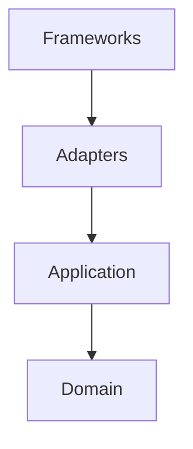
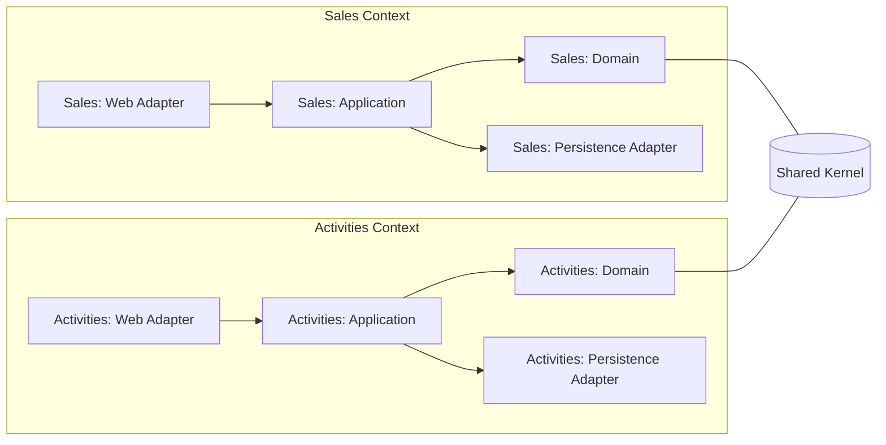

# CRM Architecture

> Status: **Draft**  
> Visibility: **Public** (`/docs/architecture.md`)

## 1. Overview
This document describes the architecture of the CRM modular monolith built with **Java 17**, **Spring Boot**, and **PostgreSQL**. It follows **DDD + Clean Architecture** with a **modular monolith** package structure so components can later be extracted into services.

### Goals
- Keep the **domain/application core** independent from frameworks.
- Enable **fast development** with clear boundaries and **testability**.
- Make future extraction to microservices straightforward.

### Non‑Goals
- Implement microservices now.
- Describe feature‑level behavior (covered in context‑specific docs).

## 2. Architecture Style
- **Domain‑Driven Design** for ubiquitous language and boundaries.
- **Clean Architecture (Ports & Adapters)** for framework isolation.
- **Modular Monolith**: one deployable unit; strongly modular internal design.

```mermaid
flowchart LR
  subgraph Core[Domain/Application (Core)]
    D[Domain Layer] --> A[Application Layer]
  end
  subgraph Adapters[Adapters]
    W[Web Adapter (HTTP/REST)]
    P[Persistence Adapter (JPA/Hibernate)]
  end

  W --> A
  A --> P
```

## 3. Bounded Contexts & Package Blueprint
Top‑level package: `com.example.crm`

```
com.example.crm
├─ sales/
│  ├─ domain/            # Aggregates, Value Objects, Domain Events
│  ├─ application/       # Use cases (services), Ports
│  ├─ adapters/
│  │  ├─ web/            # Controllers, DTOs, Mappers (DTO↔Domain)
│  │  └─ persistence/    # JPA entities, Spring Data impls (Domain↔JPA)
│  └─ config/            # Spring wiring for this context
├─ activities/
│  └─ ... (same pattern)
└─ shared/               # Shared Kernel (see rules below)
```

### Shared Kernel Rules
- Only **cross‑context value objects**, common errors, and shared utilities.  
- **No business rules** of a specific bounded context.  
- Changes require **review** from all owning contexts.

## 4. Dependency Rule
- `domain` depends on **nothing** outside the language/runtime.
- `application` depends only on `domain` and **ports**.
- `adapters` depend on `application` (implement ports) and frameworks.
- Spring, JPA, and web frameworks live **only** in adapters/config.



## 5. Cross‑Cutting Policies
- **Errors**: RFC‑7807 Problem+JSON for HTTP responses (web adapter).  
- **Validation**: Bean Validation on DTOs; invariants enforced in domain.  
- **Transactions**: boundary at **application services** (`@Transactional`).  
- **Logging**: structured logs with correlation IDs; no logging in domain.  
- **Observability**: Spring Boot **Actuator** + **Micrometer** metrics.  
- **Resilience**: **Resilience4j** for retries/timeouts/circuit breakers.

## 6. Persistence Strategy
- **PostgreSQL** via **Spring Data JPA (Hibernate)**.  
- **Flyway** for versioned schema migrations; run on startup and in tests.  
- Avoid leaking JPA types into domain; map with **MapStruct** or manual.

## 7. Mapping
- **MapStruct** at the edges (DTO↔Domain, Domain↔JPA).  
- Keep mapping logic **dumb**; complex transformations belong to use cases.

## 8. Security
- **Spring Security + JWT** (stateless).  
- Roles/authorities enforced at controller and/or method level.  
- Secret/config via environment variables.

## 9. API & Documentation
- RESTful APIs; **springdoc‑openapi** auto‑generates Swagger UI & JSON.  
- Export OpenAPI JSON to `docs/openapi/openapi.json` via CI.

## 10. Testing Strategy
- **Slice tests**: `@WebMvcTest`, `@DataJpaTest`, `@JsonTest`.  
- **E2E**: Testcontainers (Postgres) with Flyway migrations.  
- Coverage target ≈ **70%** with emphasis on domain rules and core flows.

## 11. Build & Deployment
- **Gradle** build; multi‑stage **Dockerfile**.  
- `docker-compose` for local dev (app + Postgres + pgAdmin).  
- CI: build, tests (slice + E2E), OWASP dep check, export OpenAPI, publish image.

## 12. Initial Contexts (WIP)
- **sales**: deals, contacts, companies (MVP focus).  
- **activities**: notes, tasks, emails.  
- **shared**: pagination, Problem+JSON, IDs, money, time.

## 13. ADRs
- ADR‑0001 — *Adopt DDD + Clean Architecture (Modular Monolith)* (planned).  
- ADR‑0002 — *JWT strategy (stateless, expiration, refresh?)* (planned).  
- ADR‑0003 — *Mapping strategy (MapStruct default)* (planned).

## 14. Diagrams (Optional)


## 15. Glossary
- **Port**: interface defined in the core; implemented by an adapter.  
- **Adapter**: IO boundary (web/persistence) that implements ports.  
- **Aggregate**: cluster of domain objects treated as a consistency boundary.

---
**Index Policy**: Public docs go under `/docs` and are linked from `docs/index.md`. Sensitive or exploratory notes go under `/docs/private` and are linked from `docs/private/index.md`.

